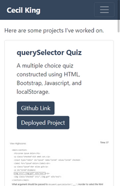
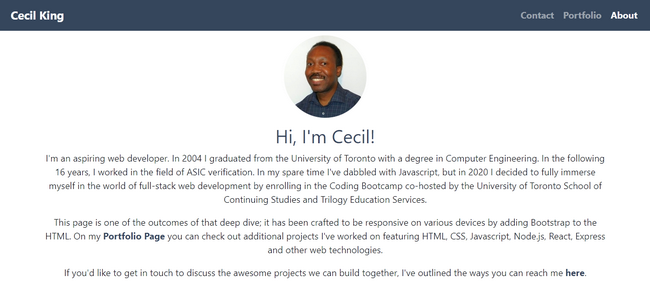
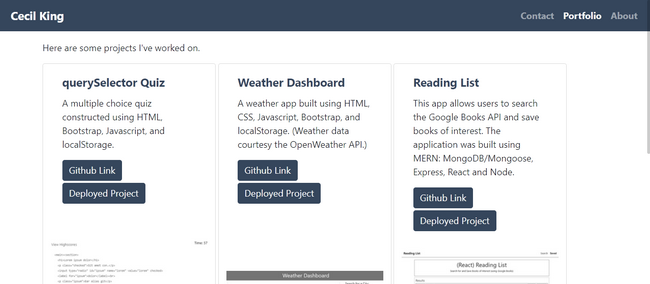

# Responsive Portofio Page
This repo contains a [website](https://cek333.github.io/Responsive_Portfolio/) showcasing a selection of my full-stack web development projects. The site was built using Bootstrap to enable a responsive design which looks good on a variety of devices and screen sizes. 

From the screen shots below, you can see how the layout changes depending on the screen size.

## Layout on Small Screens

## Layout on Medium-sized Screens

## Layout on Large Screens

You can view the deployed website [here](https://cek333.github.io/Responsive_Portfolio/).
